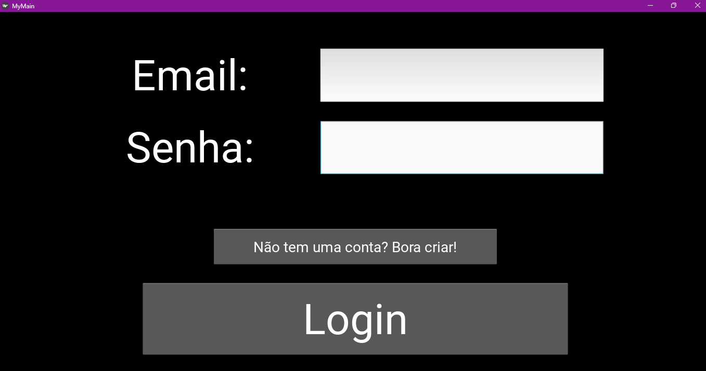
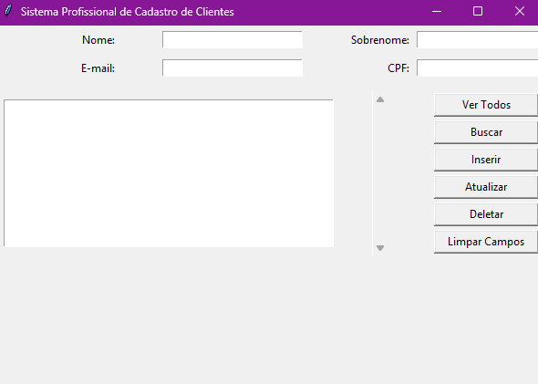

# Trilha: Linguagem de Programação Python (Fundação Bradesco)

Este repositório contém todos os exercícios, fundamentos e projetos desenvolvidos durante a Formação de Python (53h) da Escola Virtual Fundação Bradesco.

## 🗂️ Estrutura do Repositório

* **`/Python Basics`**: Scripts de lógica de programação, tipos de dados e laços de repetição.
* **`/POO`** e **`/Desenvolvimento Orientado a POO`**: Implementações de Abstração, Herança, Polimorfismo e Encapsulamento.
* **`/ProjetoInterface`**: Aplicações gráficas completas.
  * 🔐 `kivy_login_app`: Sistema de Autenticação MVC com interface nativa Kivy.

## Projetos Destaque
Para ver o detalhamento arquitetural do projeto principal, acesse o [README do Projeto de Login com Kivy](./ProjetoInterface/kivy_login_app/README.md).


# 🔐 App de Autenticação com Kivy (Projeto 1)



## 📌 Sobre o Projeto
Desenvolvi este sistema completo de login e registro de usuários como o primeiro projeto prático da Trilha de Python da Fundação Bradesco. A aplicação simula um fluxo real de autenticação, possuindo validação de credenciais, persistência local de dados e transição dinâmica de telas.

## 🛠️ Ferramentas e Tecnologias
* **Python 3.x:** Linguagem principal do ecossistema.
* **Kivy:** Framework multiplataforma utilizado para a renderização da Interface Gráfica (GUI) com aceleração via OpenGL.
* **Padrão MVC (Model-View-Controller):** Arquitetura adotada para separar a interface visual da lógica de negócios.

## 🚀 Melhorias e Arquitetura Implementada
Para elevar o nível do projeto original proposto no curso para um padrão de mercado, apliquei diversos conceitos de Engenharia de Software e refatorei a base de código:

* **Separação de Responsabilidades (SoC):** Isolei a marcação do layout no arquivo declarativo `my.kv` (View), mantendo o `main.py` (Controller) limpo e focado puramente na lógica de roteamento (`ScreenManager`).
* **I/O Seguro (Context Managers):** Refatorei o módulo `database.py` (Model) substituindo a abertura clássica de arquivos pela estrutura `with open(...)`. Isso garante a liberação correta dos *File Descriptors* do Sistema Operacional e previne corrupção de dados.
* **Orientação a Objetos Avançada:** Utilizei classes abstratas do Kivy (`Screen`) para modularizar cada tela e centralizei o gerenciamento do estado dos usuários.
* **Tratamento de Exceções Visual:** Implementei `Popups` nativos para alertar o usuário sobre credenciais inválidas ou formulários vazios, garantindo uma UX (User Experience) resiliente.

## ⚙️ Como Executar Localmente

Siga os passos abaixo para rodar a aplicação em sua máquina:

1. **Clone o repositório e navegue até a pasta do projeto:**
   ```bash
   cd kivy_login_app

2. **Crie e ative um Ambiente Virtual (Venv):**
```bash
python -m venv venv
# No Windows:
venv\Scripts\activate
# No Linux/macOS:
source venv/bin/activate

```


3. **Instale as dependências do Kivy:**
```bash
python -m pip install --upgrade pip setuptools virtualenv
pip install kivy[base] kivy_deps.sdl2 kivy_deps.glew

```


4. **Execute o aplicativo:**
```bash
python main.py

```


## 📁 Estrutura de Arquivos

```text
kivy_login_app/
│
├── database.py       # Lógica de manipulação do banco de dados (.txt)
├── main.py           # Ponto de entrada, lógica de telas e popups
├── my.kv             # Estrutura declarativa da Interface Gráfica
├── users.txt         # Arquivo gerado automaticamente contendo os dados
└── docs/
    └── example.png   # Screenshot da interface

```
---

# 🗄️ App de Cadastro de Clientes com SQLite (Projeto 2)

   

## 📌 Sobre o Projeto
Desenvolvido como o projeto final do módulo de Estruturas de Dados e Banco de Dados da Trilha Python. Trata-se de um sistema CRUD (Create, Read, Update, Delete) desktop completo, integrado a um banco de dados relacional embarcado (SQLite). O sistema permite o gerenciamento de clientes em uma interface gráfica intuitiva e performática.

## 🛠️ Ferramentas e Tecnologias
* **Python 3.x:** Linguagem base da aplicação.
* **Tkinter:** Biblioteca gráfica padrão do Python (GUI) utilizada para a construção do *Frontend*.
* **SQLite3 (DB-API 2.0):** Motor de banco de dados relacional embutido (*embedded database*) operando nativamente em C para latência ultrabaixa.
* **PyInstaller:** Utilizado para o deploy e empacotamento da aplicação em um executável autônomo (`.exe`).

## 🚀 Melhorias e Arquitetura Implementada
O projeto original do curso foi completamente refatorado para aderir a padrões de Engenharia de Software e melhores práticas de mercado:

* **Arquitetura MVC (Model-View-Controller):** Separação estrita de responsabilidades. A interface gráfica (Tkinter) atua como View/Controller centralizada no arquivo `main.py`, enquanto toda a lógica de persistência de dados (Model) foi encapsulada no `database.py`.
* **Programação Orientada a Objetos (POO):** Eliminação total de variáveis globais (`global`). A aplicação foi estruturada dentro da classe `AppCliente`, garantindo o encapsulamento seguro do estado da interface (como o controle da linha selecionada no Listbox).
* **Gerenciamento de Contexto (`with` statements):** Implementação de gerenciadores de contexto nas transações do banco de dados (`with sqlite3.connect(...)`). Isso garante o fechamento seguro da conexão e prevenção de *memory leaks* e *database locks*, mesmo em caso de exceções no código.
* **Segurança de Execução:** O motor do banco de dados foi configurado com `CREATE TABLE IF NOT EXISTS`, permitindo que a infraestrutura física (`clientes.db`) nasça de forma autônoma e limpa na primeira execução do software pelo usuário final.

## ⚙️ Como Executar Localmente

Siga os passos abaixo para rodar a aplicação via código-fonte em sua máquina:

1. **Navegue até a pasta do projeto:**
   ```bash
   cd ProjetoInterface/crud_sqlite_app
   ``` 
Execute o aplicativo:

```bash
python main.py
```
Nota: Não é necessário instalar bibliotecas externas via pip (exceto se for gerar o build com PyInstaller), pois o Tkinter e o SQLite3 fazem parte da biblioteca padrão do Python (Standard Library).

📦 Como Gerar o Executável (Deploy)
Caso queira gerar a versão .exe para distribuição no Windows:

```bash
pip install pyinstaller
pyinstaller --onefile --windowed main.py
```
O arquivo final estará disponível na pasta dist/.

📁 Estrutura de Arquivos
```text
crud_sqlite_app/
│
├── database.py       # (Model) Lógica e queries do banco de dados relacional
├── main.py           # (View/Controller) Interface gráfica e eventos do Tkinter
├── main.spec         # Configurações de build do PyInstaller
├── .gitignore        # Bloqueio de artefatos de build e instâncias do banco (.db)
└── docs/
    └── example.png   # Screenshot da interface
